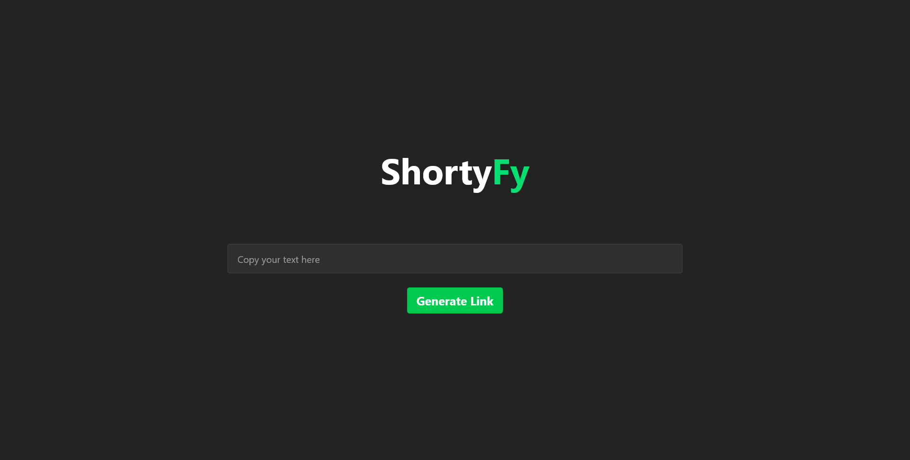
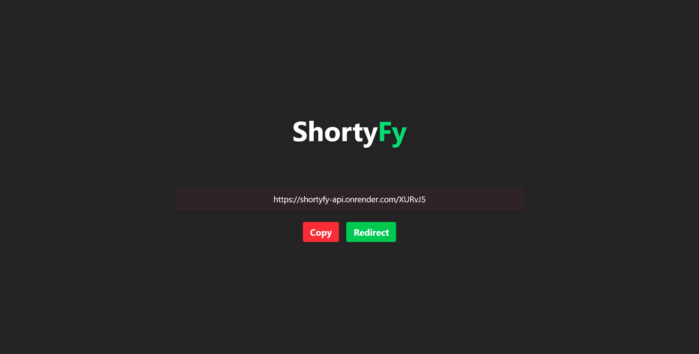
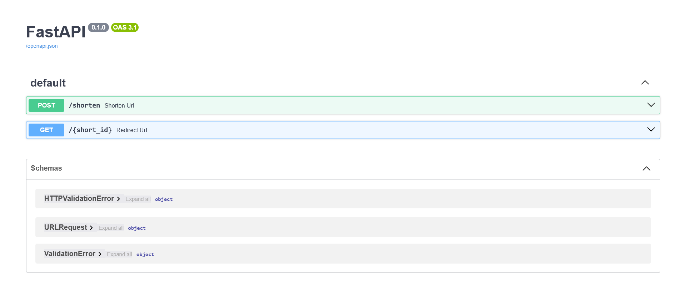

# Shortyfy

<!-- centralizar logo -->
<p align="center">
  
</p>

Shortyfy é um projeto criado para aprender conceitos de **CRUD** usando Python, com consumo da API em um frontend em React. O app permite encurtar links e redirecionar o usuário automaticamente para a URL encurtada.  
Está hospedado gratuitamente em [Render](https://shortyfy.onrender.com).

---

## Funcionalidades

- Encurtar URLs longas.
- Redirecionamento automático ao usar a URL encurtada.
- API documentada e testável via SwaggerUI.
- Frontend moderno com React + TypeScript + TailwindCSS + Vite.

---

### Tecnologias Utilizadas

- Backend: Python, FastAPI, Supabase

- Frontend: React, TypeScript, TailwindCSS, Vite

- Containerização: Docker

- Hospedagem: Render

---

## Estrutura do Backend

```bash
backend/
├── app/
│   ├── db/
│   │   └── supabase.py         # Configuração do banco de dados
│   ├── models/
│   │   └── url_request.py      # Modelos de dados
│   ├── routes/
│   │   └── urls.py             # Endpoints da API
│   ├── utils/
│   │   └── shortener.py        # Funções de encurtamento
│   └── main.py                 # Arquivo principal do FastAPI
├── .env                        # Variáveis de ambiente (não versionar)
├── .env.example                # Exemplo de variáveis de ambiente
├── .python-version             # Versão do Python
├── Dockerfile                  # Dockerfile para o backend
├── pyproject.toml              # Configuração do projeto Python
├── README.md                   # Este arquivo
└── uv.lock                     # Lockfile do Poetry
```

## Estrutura do Frontend
```
frontend/
├── public/                     # Arquivos estáticos
├── src/
│   ├── assets/                 # Imagens e ícones
│   ├── pages/
│   │   ├── Home.tsx            # Página principal
│   │   └── Result.tsx          # Página de resultados
│   ├── util/
│   │   └── tools.ts            # Funções utilitárias
│   ├── App.css
│   ├── App.tsx
│   ├── index.css
│   ├── main.tsx
│   └── vite-env.d.ts
├── eslint.config.js
├── index.html
├── package.json
├── tsconfig.app.json
├── tsconfig.json
├── tsconfig.node.json
└── vite.config.ts
```

## Como rodar localmente

### Requisitos

- Python 3.11

- Docker (opcional)

---

### Backend

1. Navegue até a pasta do backend:

```bash
cd backend
```

2. Instale as dependências usando o pyproject.toml:

```bash
pip install .
```

3. Configure suas variáveis de ambiente copiando o .env.example:

```bash
cp .env.example .env
```

4. Execute o servidor FastAPI diretamente com uvicorn:
```bash
uvicorn app.main:app --reload --host 0.0.0.0 --port 8000
```

---

### Frontend

1. Navegue até a pasta do frontend:

```bash
cd frontend
```

2. Instale as dependências:

```bash
npm install
```

3. Execute o servidor de desenvolvimento:

```bash
npm run dev
```

## Acesse o App

O app está hospedado gratuitamente em: https://shortyfy.onrender.com





Você pode testar a API diretamente via SwaggerUI em: https://shortyfy-api.onrender.com/docs




### Contribuição

Contribuições são bem-vindas!
Para contribuir:

1. Fork este repositório

2. Crie uma branch com sua feature: git checkout -b minha-feature

1. Commit suas mudanças: git commit -m 'Adicionei nova feature'

1. Push para sua branch: git push origin minha-feature

1. Abra um Pull Request